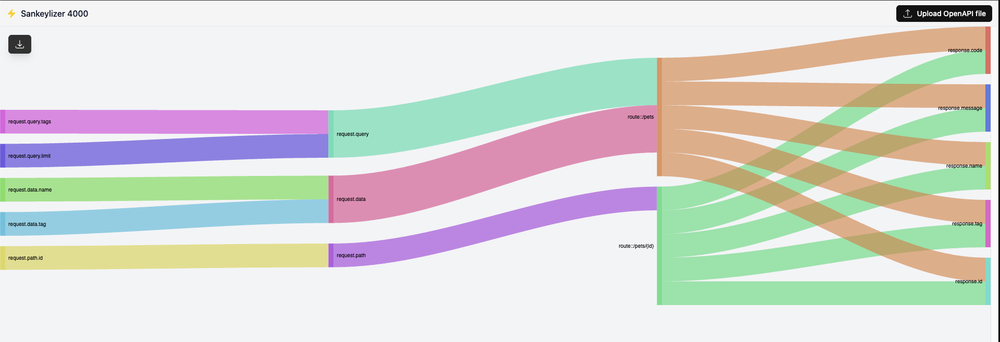
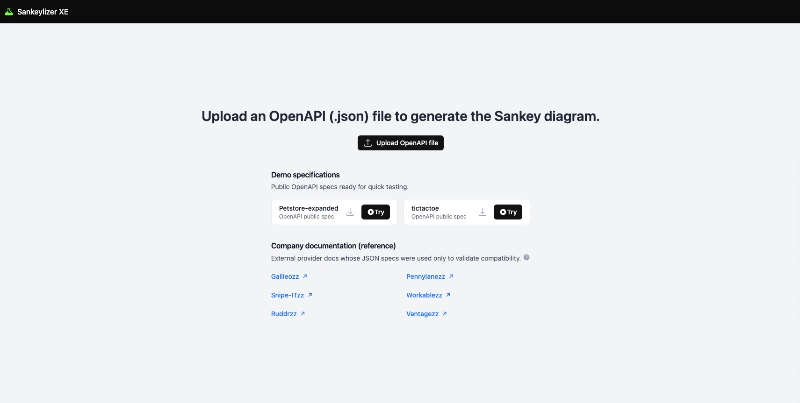
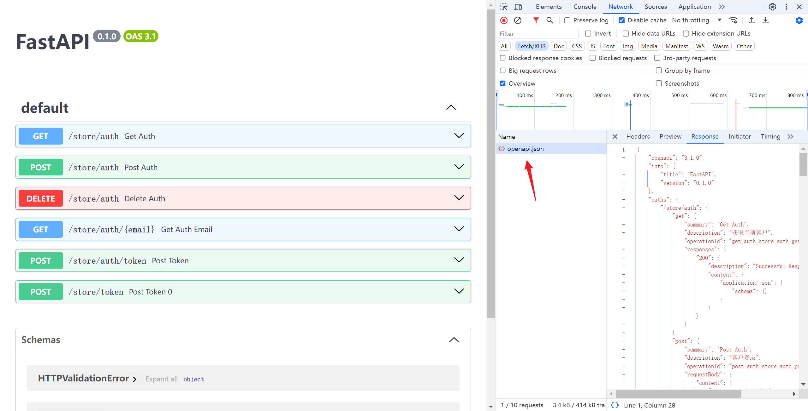
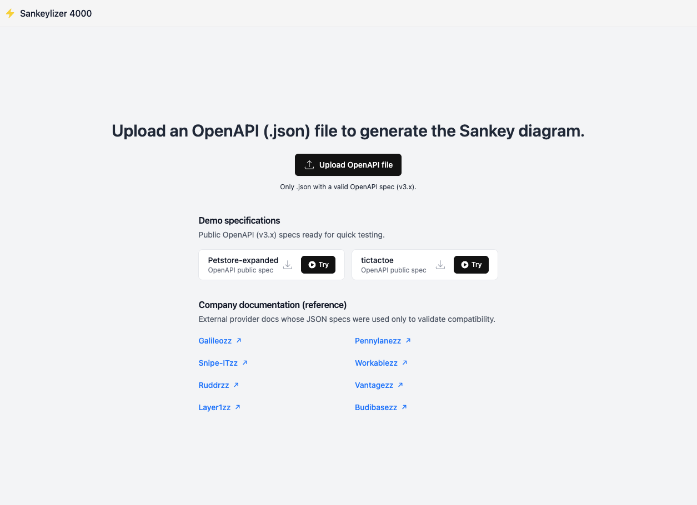
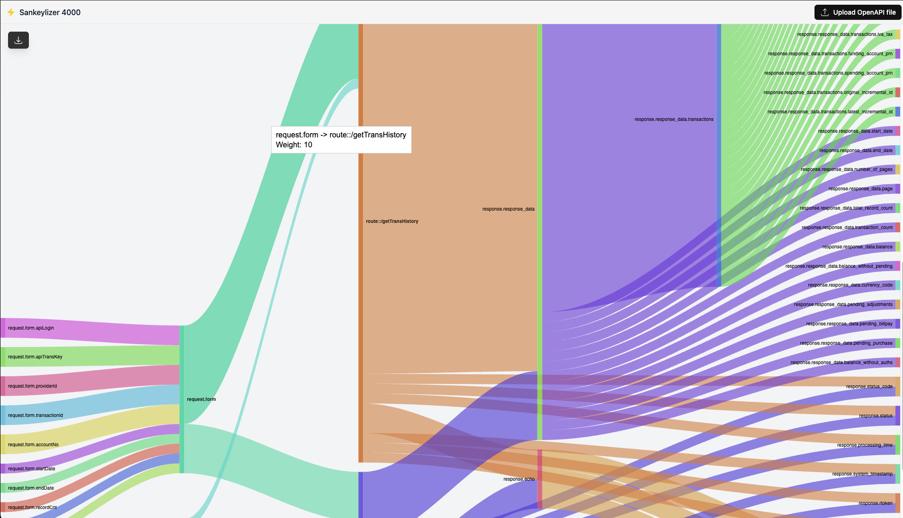
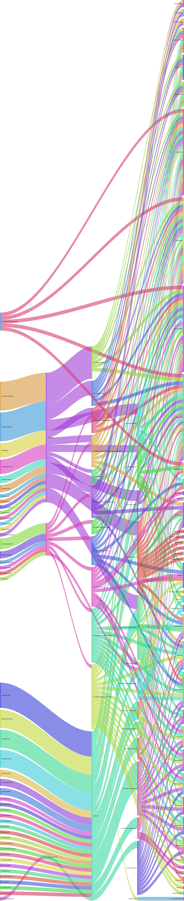

# Sankeylizer

[](./4.png)

## What is it?

Sankeylizer is a web app that generates **Sankey diagrams** from **OpenAPI v3 specs**.  
It parses `request` and `response` fields across endpoints, resolves `$ref` references and schema compositions, and renders the flow of data with **Google Charts**.  
The diagram can be **exported as PNG**.

### Highlights

-   **Schema traversal:** supports `$ref`, `allOf`, `oneOf`, `anyOf`, arrays, nested objects, and `additionalProperties`.
-   **Parameters:** `query`, `path`, `header`, `cookie`, `form`, `multipart`.
-   **Graph construction:** `request.*` → `route::*` → `response.*`.
-   **Processing:** Web Worker for non-blocking parsing.
-   **Export:** PNG download of the generated Sankey.

### Architecture (brief)

-   **Client:** React
-   **Visualization:** Google Charts (Sankey)
-   **Worker:** background spec parsing

### Quick Start

```bash
npm install
npm run dev
# → http://localhost:5173
```

---

## ¿Qué es?

Sankeylizer es una aplicación web que genera **diagramas Sankey** a partir de **especificaciones OpenAPI v3**.  
Analiza los campos de `request` y `response` en los endpoints, resuelve referencias `$ref` y combinaciones de schemas, y muestra el flujo de datos con **Google Charts**.  
El diagrama puede **exportarse como PNG**.

### Highlights

-   **Recorrido de schemas:** soporta `$ref`, `allOf`, `oneOf`, `anyOf`, arrays, objetos anidados y `additionalProperties`.
-   **Parámetros:** `query`, `path`, `header`, `cookie`, `form`, `multipart`.
-   **Construcción del grafo:** `request.*` → `route::*` → `response.*`.
-   **Procesamiento:** Web Worker para análisis sin bloquear la UI.
-   **Exportación:** descarga en PNG del Sankey generado.

### Arquitectura (resumen)

-   **Cliente:** React
-   **Visualización:** Google Charts (Sankey)
-   **Worker:** procesamiento en segundo plano

### Inicio rápido

```bash
npm install
npm run dev
# → http://localhost:5173
```

---

## 📸 Screenshots

  
  
  
  
  

