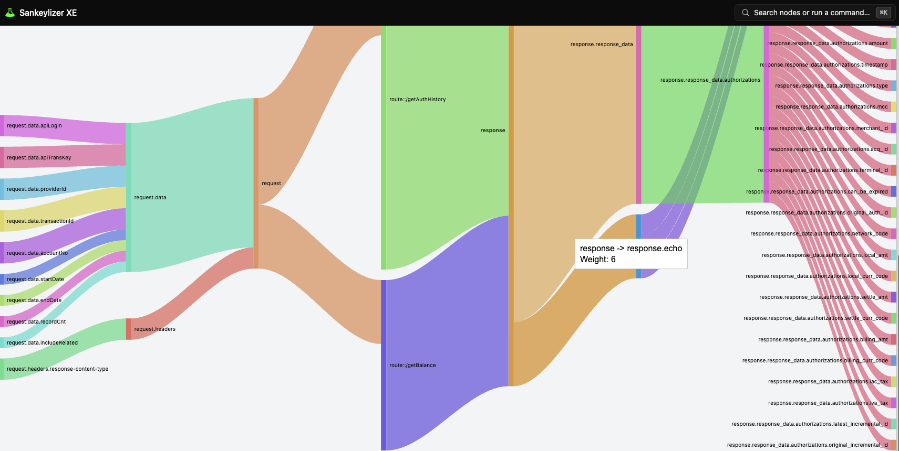
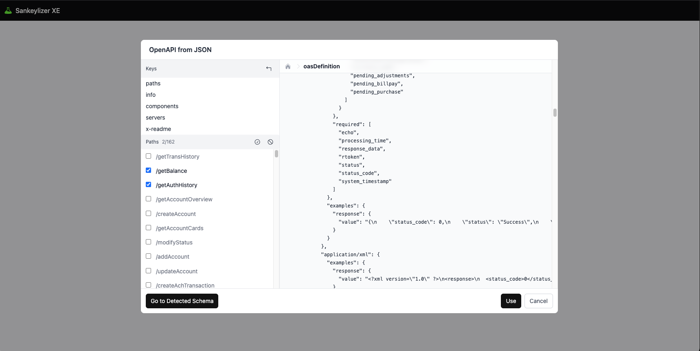
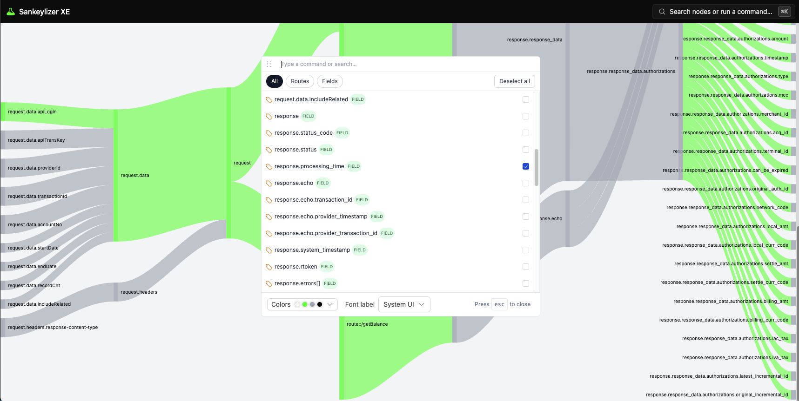

# Sankeylizer XE

[](./4.png)

### What is it?

Sankeylizer is a web app that turns **OpenAPI (.json)** into **interactive Sankey diagrams** so you can see request/response flows per endpoint at a glance. It resolves schema compositions, maps parameters across layers, builds the flow graph, and lets you explore and export it.

### Key Features

-   **OpenAPI → Sankey** (from JSON to a navigable flow graph)
-   **Schema compositions**: `$ref`, `allOf`, `oneOf`, `anyOf` (resolution and node linking)
-   **Parameters coverage**: `query`, `path`, `header`, `cookie`, `form`, `multipart` (per-endpoint mapping)
-   **Path Selector** (cut the spec by paths for focused analysis)
-   **Command Palette** (fast search and quick actions on routes/fields)
-   **Highlight** (focus without recomputing the whole graph)
-   **Theming** (background, selection/dim/text colors; optional title/footer in export)
-   **Background processing** (Web Worker to keep the UI responsive)
-   **Export**: **PNG** (raw 1:1 or HQ resampling with safe bounds)
-   **Responsive canvas** (dynamic height and redraw on window resize)

### Architecture

-   UI: **React** + state via **Recoil** atoms/selectors for theme, selection and export settings.
-   Visualization: **Google Charts** (**Sankey**). Loader bootstrapped at runtime and chart instantiated with dynamic height and redraw on resize.
-   Command palette: **kbar** (portal, positioner, search, matches) wrapped in a provider for action registration.
-   Draggable UI: **interactjs** to drag the command palette within viewport bounds.
-   Headless UI + Heroicons: **Headless UI** + **Heroicons** for menu/portal/transition primitives and icon set for controls.
-   Utility classes: **clsx** for deterministic class composition across components.
-   Background worker: **Web Worker** (module) for graph generation and repaint-only updates when structure is unchanged.
-   Theme & fonts: global theme atoms and on-demand **Google Fonts** list in the UI footer.
-   Export pipeline: custom **SVG/Canvas** exporter with safe caps (max side/area) and 1:1 or HQ resampling.

### Quick Start

```bash
npm install
npm run dev
# → http://localhost:5173
```

## 📸 Screenshots

  

  
  
  
  
  
  
  
  
  

